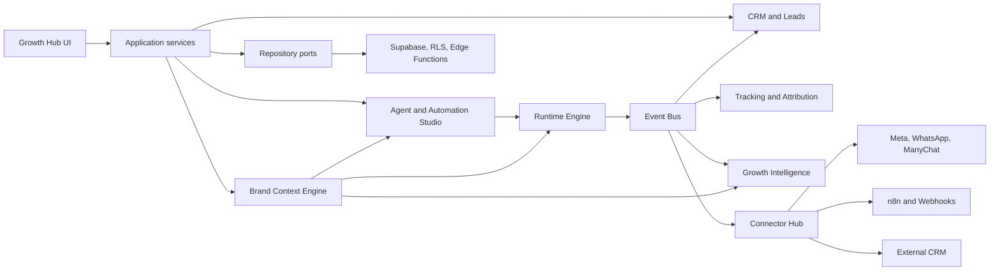

# Fluxrow Growth Hub — Ultra Review

**Data da análise:** 10 de junho de 2026
**Repositório:** fluxrow/flux-agent-studio
**Escopo:** arquitetura, produto, limpeza e plano de transformação multi-contas e multi-clientes.

---

## Veredito executivo

O projeto tem base suficiente para se tornar o **Fluxrow Growth Hub**. Não deve
ser reconstruído do zero. Runtime, Builder, eventos, persistência, Auth,
Workspaces, CRM, Tracking e Supabase formam um núcleo valioso.

O problema principal não é ausência de arquitetura. É a coexistência de:

- módulos reais, mocks, stubs e demos sob os mesmos nomes;
- duas ou mais implementações para o mesmo domínio;
- documentação antiga descrevendo estados já alterados;
- conceitos de workspace, cliente, projeto, marca e bot sem hierarquia final;
- telas que prometem capacidades ainda sem projeções de dados reais;
- integrações com código parcial, mas sem prova de deploy ponta a ponta.

**Recomendação final:** **B) bifurcar para novo produto**, usando este repositório
como base técnica e organizando o fork como monólito modular. A estratégia
interna do fork deve seguir D, isto é, divisão em bounded contexts, mas sem
microserviços prematuros.

---

## Diagnóstico geral

### Estimativa de reaproveitamento

| Área | Estado atual | Reaproveitamento |
|---|---|---|
| Runtime Engine | Núcleo funcional e desacoplado | 90% |
| Builder visual | Funcional, com validação e publicação | 80% |
| Public Bot Runtime | Funcional; segurança de IA endurecida nesta fase | 85% |
| Auth, Workspaces e RLS | Boa fundação multi-tenant | 75% |
| CRM e Leads | CRUD e pipeline reaproveitáveis | 70% |
| Eventos e repositórios | Boa direção, implementação ainda desigual | 70% |
| Lead Intelligence | Motores puros úteis; dependem de dados confiáveis | 70% |
| Tracking | Captura e destinos existentes; projeções incompletas | 65% |
| AI Builder | Pipeline útil; geração ainda muito baseada em templates | 65% |
| Meta / WhatsApp / Instagram | Infraestrutura parcial, ainda duplicada com stubs | 60% |
| Connector Hub | Contratos bons; adapters e credenciais inconsistentes | 55% |
| Knowledge Base | Pipeline reaproveitável; persistência/embeddings precisam consolidação | 50% |
| Calendar | Implementação recente, sem E2E de produção comprovado | 50% |
| Analytics / Revenue / Attribution | UI demo ou estado vazio sem projeções reais | 35% |

### Módulos prontos

- **Runtime Engine:** deve permanecer como executor agnóstico de canal.
- **Builder visual:** deve continuar produzindo o mesmo contrato de Flow.
- **Public web runtime:** é o canal mais maduro para o primeiro MVP.
- **Auth e isolamento por workspace:** base válida para a futura conta/tenant.
- **Event bus:** mecanismo adequado para conectar Runtime, CRM, Tracking, Intelligence e Connectors.
- **Scoring e recomendações:** lógica pura com bom potencial de reutilização.
- **Persistence facade:** direção arquitetural correta para separar domínio de Supabase e mocks.

### Módulos reaproveitáveis, mas incompletos

- **CRM:** falta identidade omnichannel, deduplicação, campos de contexto de marca, lead magnets e visão por cliente.
- **Tracking:** falta consolidar eventos em projeções de Growth confiáveis.
- **Knowledge Base:** deve virar fonte do Context Engine, não um silo isolado.
- **AI Builder:** deve consumir Context Engine e gerar artefatos versionados.
- **Connector Hub:** precisa ser o único caminho para integrações externas.
- **Meta:** Edge Functions e tabelas existem, mas os canais antigos continuam registrados como stubs em paralelo.
- **Calendar:** precisa de prova OAuth, refresh, sync e reconciliação em ambiente real antes de ser marcado como pronto.
- **Analytics:** precisa abandonar o padrão "demo ou vazio" e ler projeções derivadas dos eventos reais.

### Módulos quebrados ou conflitantes

- **Channels duplicados:** `src/channels/index.ts` ainda registra WhatsApp, Instagram e Messenger como stubs, enquanto `src/channels/meta/` implementa outro caminho.
- **Connector Hub ambíguo:** manifests se declaram mockados, embora alguns adapters façam chamadas reais.
- **Templates:** domínio explicitamente marcado como stub no modo Supabase.
- **Revenue e Attribution:** não têm projeção real; fora do demo mostram apenas estado vazio.
- **Persistência desigual:** o arquivo `notImplemented.ts` contém partes reais, stubs e dívida de tipagem, tornando o nome e a responsabilidade enganosos.
- **Qualidade global:** lint atual registra 71 erros e 23 avisos. Os arquivos alterados nesta fase estão limpos, mas o repositório inteiro ainda não está.
- **Ambiente único:** há um único projeto Supabase configurado; falta separação clara entre desenvolvimento, staging e produção.
- **Documentação temporalmente inconsistente:** auditorias antigas ainda dizem que Meta, Calendar ou IA não existem, embora o código atual já contenha implementações parciais.

### O que remover ou arquivar

- Não apagar mocks de forma indiscriminada. O demo determinístico é útil para vendas e QA, mas precisa ficar isolado.
- Remover os adapters Meta antigos de `stubs.ts` quando o adapter canônico assumir o registro no Channel Engine.
- Separar manifests reais de catálogo demonstrativo.
- Arquivar documentos de "reality check" superados por uma fonte de verdade datada e gerada a partir do código.
- Retirar rotas de debug, QA e system health do produto comercial ou mantê-las apenas em build/admin interno.
- Adiar do MVP Templates Marketplace, billing avançado, white label profundo e páginas sem dados reais.
- Renomear `notImplemented.ts` e dividir seu conteúdo por repositório.
- Remover componentes sem importação somente após inventário automatizado e confirmação por build/teste.

---

## Reposicionamento e nomes

### Produto

- **FluxBot** e **Flux Agent Studio** devem virar **Fluxrow Growth Hub**.
- "Bot" deve ser uma capacidade, não o objeto central do produto.
- "Studio" pode permanecer como nome do módulo de criação: **Automation Studio** ou **Agent Studio**.

### Modelo conceitual recomendado

| Conceito final | Responsabilidade |
|---|---|
| Account / Tenant | Limite de segurança, usuários, billing e RLS |
| Client | Empresa atendida pela agência ou operador |
| Brand | Identidade, contexto, canais, ofertas e dados de crescimento |
| Project | Agrupamento opcional de execução |
| Campaign | Iniciativa temporal com objetivo, conteúdo, CTA e métricas |
| Agent | Comportamento de IA associado a uma Brand |
| Flow | Automação executável pelo Runtime |

O **workspace** atual deve evoluir para **Account/Tenant**. Não deve representar
ao mesmo tempo cliente, marca, projeto e ambiente.

### Context Engine

O Context Engine deve ser um bounded context próprio, versionado e acessado por
porta, não por consultas espalhadas.

Entidades mínimas por marca:

- perfil e tom de voz;
- públicos e segmentos;
- ofertas, produtos e serviços;
- dores, desejos e objeções;
- CTAs e lead magnets;
- campanhas e conteúdos;
- canais conectados;
- histórico e aprendizados;
- regras de compliance;
- fontes de conhecimento.

Contrato central:

```ts
resolveBrandContext(brandId, purpose, channel, campaignId?)
  -> ContextSnapshot versionado
```

Esse snapshot alimenta AI Builder, blocos de IA, automações, mensagens,
campanhas, Lead Intelligence e CRM. Execuções devem registrar qual versão do
contexto foi utilizada.

---

## Arquitetura final



Recomendação: **monólito modular**, React + TypeScript + Supabase, com limites
de domínio explícitos. Não criar microserviços agora.

---

## Riscos técnicos

- Vazamento entre tenants se `workspace_id` continuar com semântica ambígua.
- Migrações e RLS sem testes automatizados de autorização.
- Tokens de integrações ainda dependentes de fluxos recentes e não validados em produção.
- Dupla implementação de canais gerando comportamentos divergentes.
- Event bus apenas em memória não garante entrega para jobs assíncronos.
- Ausência de ambiente staging.
- Bundle principal acima de 1,68 MB minificado.
- Cobertura automatizada ainda pequena: 11 testes.
- Lint global não bloqueante por dívida histórica.
- Criação pública de sessões continua exigindo proteção de infraestrutura contra abuso volumétrico, além dos limites de IA por sessão e bot.

## Riscos de produto

- Tentar entregar CRM, social inbox, conteúdo, automação, analytics e IA ao mesmo tempo.
- Renomear a interface sem resolver primeiro o modelo Account/Client/Brand.
- Tratar ManyChat, n8n e Meta como três produtos separados em vez de adapters.
- Dashboard de Growth sem fonte única de eventos e métricas.
- Personalização por cliente feita em código, impedindo escala.
- Prometer "multi-contas" antes de validar permissões, onboarding e operação de duas marcas reais simultaneamente.

---

## Ordem correta de execução

### Fase 1 — Limpeza técnica

- Eliminar conflitos entre implementações reais e stubs.
- Dividir repositórios mistos e catalogar módulos stub.
- Reduzir lint por lotes, começando por domínio e integrações.
- Adicionar testes de RLS, Edge Functions e Runtime.
- Criar staging.

Já executado localmente nesta retomada: CI bloqueante, correção da fronteira
de persistência do AI Builder, hardening de Meta/Calendar/IA e autenticação
segura para IA em bots públicos. Nada foi aplicado em produção.

**Validação local em 11 de junho de 2026:**

- typecheck concluído sem erros;
- 13 testes concluídos com sucesso;
- build de produção concluído;
- lint de todos os arquivos alterados concluído sem ocorrências;
- lint global ainda não bloqueante: 71 erros e 23 avisos históricos;
- migration SQL não aplicada e não validada contra banco local, pois não havia instância Supabase disponível em `127.0.0.1:54322`.

A revisão independente encontrou e o lote local corrigiu cinco bloqueadores:

1. escritas públicas agora exigem token de sessão e limite de frequência;
2. identificadores Meta ativos não podem gerar roteamento ambíguo entre tenants;
3. credenciais, watches e eventos do Google Calendar são isolados por workspace;
4. o sync do Calendar percorre todas as páginas antes de salvar o sync token;
5. o OAuth usa a URL real da Edge Function como redirect.

### Fase 2 — Padronização de nomes e rotas

- Criar mapa de compatibilidade de nomes.
- Renomear produto e navegação sem renomear tabelas de uma vez.
- Introduzir aliases e migrations graduais.
- Manter redirects temporários para rotas antigas.

### Fase 3 — Account / Client / Brand / Project

- Transformar Workspace em Account/Tenant.
- Criar Client e Brand como entidades distintas.
- Fazer todas as entidades operacionais apontarem para `brand_id`.
- Revisar RLS e papéis de agência, cliente e operador.

### Fase 4 — Context Engine por marca

- Implementar aggregate versionado e Context Resolver.
- Migrar Knowledge Base e configurações de IA para fontes do contexto.
- Registrar versão utilizada em cada execução.

### Fase 5 — CRM, Leads e Lead Magnets

- Identidade omnichannel e deduplicação.
- Lead magnets, consentimento, origem e campanha.
- Timeline única de eventos e conversas.
- Pipeline e scoring por marca.

### Fase 6 — ManyChat, Meta, WhatsApp e n8n

- Consolidar tudo no Connector Hub.
- ManyChat via webhook/API como primeiro adapter de aquisição.
- Meta/WhatsApp com E2E real e observabilidade.
- n8n como extensão operacional, não como fonte de verdade.

### Fase 7 — Dashboard de Growth

- Criar projeções por evento: aquisição, conversa, lead, oportunidade, venda.
- Métricas por Account, Client, Brand, Campaign e Channel.
- Só exibir métricas que tenham linhagem de dados verificável.

### Fase 8 — MVP real

Validar primeiro com:

- Promotrip
- Cauã Farias
- um terceiro cliente sem customização em código

**Critério de aprovação:** onboarding de nova marca, conexão de canais, contexto,
captura de lead, automação, CRM e dashboard funcionando sem intervenção no
repositório.

---

## Decisão final

**B) Bifurcado para novo produto**

Justificativa técnica:

- preserva a história e o produto atual enquanto o modelo de domínio muda;
- reaproveita o núcleo, evitando reconstrução cara e arriscada;
- permite limpar nomes e contratos sem manter compatibilidade visual total;
- oferece fronteira clara para Account, Client, Brand e Context Engine;
- reduz o risco de uma grande renomeação quebrar integrações e RLS existentes.

O fork não deve copiar a desorganização atual. Deve começar com o código
validado da Fase 1, arquitetura modular, novo vocabulário e backlog de remoção
explícito.
